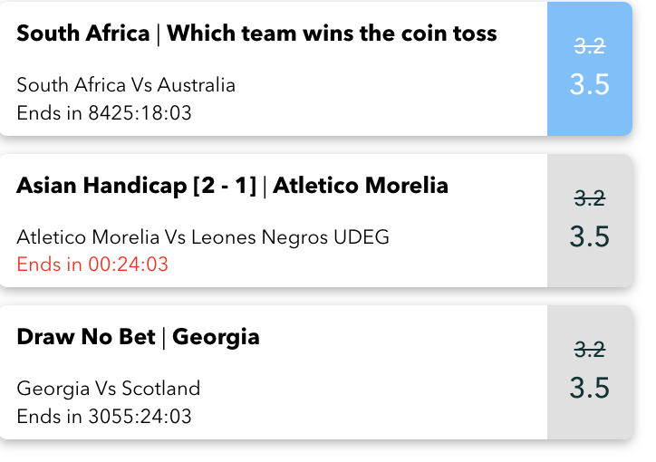

# OddsBoost

## 產品目標

本產品以資訊卡的方式呈現各個運動賽事的資訊，並以套件方式供用戶使用。用戶僅需串接套件即可將資訊卡引入自家網站使用，不須額外透過前後端工程師與設計師開發和設計介面。

***

## 產品功能

### 快速啟用

1. 創建一個OddsBoostCard 元件

```jsx
import { useEffect } from 'react';

const OddsBoostCard = () => {
  useEffect(() => {
    // 加入 js
    const script = document.body.appendChild(document.createElement('script'));
    script.src = `https://odd-boost-widget.uni247.xyz/main.js?v=${Date.now()}`;
    script.async = true;
		// 加入 css
    const style = document.head.appendChild(document.createElement('link'));
    style.rel = `stylesheet`;
    style.type = 'text/css';
    style.href = `https://odd-boost-widget.uni247.xyz/main.css?v=${Date.now()}`

    return () => {
      // 拔除 js 位置
      document.body.removeChild(script);
    };
  }, []);

}
export default OddsBoostCard;
```

1. 將下方 HTML 錨點貼上要顯示的位置，且包含OddsBoostCard元件

```html
<div id="oddsBoostWidget">
	<OddsBoostCard />
</div>
```

1. 若想自訂樣式，請於錨點的同一層元件裡，return之前貼上以下代碼

```jsx
export default function App() {
 // 屬性值請詳見“套件參數說明”
  window.boostNewStyle = {
    width: "500px",
    displayDirection: "column",
    background_color: "#fff",
    text_color: "#000",
    odd_background_color: "#e0e0e0",
    odd_text_color: "#033333",
    odd_hover_background_color: "#6CC1FF",
    odd_hover_text_color: "#fff",
    font_family: `"Avenir Next", "Demi Bold"`,
};

  return (
    <>
      <div id="oddsBoostWidget">
        <OddsBoostCard />
      </div>
    </>
  )
}
```

#### 版面配置

1. OddsBoost卡片 包含賽事資訊、剩餘時間及新舊賠率。

<figure><figcaption></figcaption></figure>

#### 功能說明

1. 每秒更新剩餘時間
2. 可針對外層容器OddsBoostStyle調整卡片顯示方向，預設為縱向；亦可調整寬度，最小寬度為350px(縱向)
3. 賽事資訊顯示部分：寬度範圍為 285px \~ 450px，將依據外層容器OddsBoostStyle寬度進行調整
4. 賠率顯示部分：寬度限定為 47px。
5. 可調整圖卡、賠率區域背景、文字 ，的顏色。文字包含聯賽名稱、比賽狀態、隊名、賠率、剩餘時間（剩餘一小時固定紅色做為提醒）。
6. 點擊卡片後，將連線至[https://sprodm.uni247.xyz/#/](https://sprodm.uni247.xyz/#/) 之orderslip(購物車)區域進行購買

#### 套件參數說明

| Name          | Type   | Attributes | Value                                                                                                                                                                                                                                                                                                                                                                    | Description                        |
| ------------- | ------ | ---------- | ------------------------------------------------------------------------------------------------------------------------------------------------------------------------------------------------------------------------------------------------------------------------------------------------------------------------------------------------------------------------ | ---------------------------------- |
| boostNewStyle | object | optional   | <pre class="language-javascript"><code class="lang-javascript">{  
  width: "350px",
  displayDirection: "column",
  background_color: "#fff",
  text_color: "#000",
  odd_background_color: "#e0e0e0",
  odd_text_color: "#033333",
  odd_hover_background_color: "#6CC1FF",
  odd_hover_text_color: "#fff",
  font_family: "Avenir Next", "Demi Bold"
} 
</code></pre> | 物件，可調整顯示樣式 詳見 boostNewStyle 參數說明。  |


* boostNewStyle 參數說明


| Name                          | Type   | Attributes | Value                      | Description                                                                                                                                    |
| ----------------------------- | ------ | ---------- | -------------------------- | ---------------------------------------------------------------------------------------------------------------------------------------------- |
| width                         | string | optional   | 350px                      | <ol><li>功能為調整外部容器寬度。</li><li>寬度最小為350px (但卡片最大為511px) 設定的參數值如小於 350px，將以 350px計算。</li><li>如不調整寬度參數，則可直接不添加該 key 值，寬度會以 350px 計算。</li></ol>     |
| displayDirection              | string | optional   | column                     | <p>為卡片的陳列方向，有縱向(column)及橫向(row)<br>預設為column</p>                                                                                               |
| background\_color             | string | optional   | #fff                       | <ol><li> 功能為調整賽事資訊背景色。</li><li>可輸入顏色名稱、三原色光(RGB)模式、十六進位(HEX)色碼。</li><li>如不調整顏色，則可直接不添加該 key 值，顏色會以 #fff (白色) 計算。</li></ol>                     |
| text\_color                   | string | optional   | #000                       | <ol><li>功能為調整賽事資訊文字顏色。</li><li>可輸入顏色名稱、三原色光(RGB)模式、十六進位(HEX)色碼。</li><li>如不調整顏色，則可直接不添加該 key 值，顏色會以 #000(黑色)計算。</li></ol>                       |
| odd\_background\_color        | string | optional   | #e0e0e0                    | <ol><li>功能為調整賠率背景顏色。</li><li>可輸入顏色名稱、三原色光(RGB)模式、十六進位(HEX)色碼。</li><li>如不調整顏色，則可直接不添加該 key 值，顏色會以 #e0e0e0(淺灰色) 計算。</li></ol>                    |
| odd\_text\_color              | string | optional   | #033333                    | <ol><li>功能為調整賠率文字顏色。</li><li>可輸入顏色名稱、三原色光(RGB)模式、十六進位(HEX)色碼。</li><li>如不調整顏色，則可直接不添加該 key 值，顏色會以 #033333(深藍色)計算。</li></ol>                     |
| odd\_hover\_background\_color | string | optional   | #6CC1FF                    | <ol><li>功能為調整賠率當鼠標滑過背景顏色，若為手機版則為點擊過後之顏色。</li><li>可輸入顏色名稱、三原色光(RGB)模式、十六進位(HEX)色碼。</li><li>如不調整顏色，則可直接不添加該 key 值，顏色會以 #6CC1FF(淺藍色)計算。</li></ol> |
| odd\_hover\_text\_color       | string | optional   | #fff                       | <ol><li>功能為調整賠率當鼠標滑過文字顏色，若為手機版則為點擊過後之顏色。</li><li>可輸入顏色名稱、三原色光(RGB)模式、十六進位(HEX)色碼。</li><li>如不調整顏色，則可直接不添加該 key 值，顏色會以 #fff(白色)計算。</li></ol>     |
| font\_family                  | string | optional   | "Avenir Next", "Demi Bold” | 功能為調整整個卡片的文字樣式，若不調整文字樣式值，則預設為"Avenir Next", "Demi Bold”                                                                                        |

## 補充

#### 示例

* 請將下方兩個文檔創建置於同一目錄下

demo.html

```html
<!DOCTYPE html>
<html lang="en">

<head>
    <meta charset="UTF-8">
    <meta name="viewport" content="width=device-width, initial-scale=1.0">
    <title>Document</title>
</head>

<body>
    <!-- 渲染比分卡组件的容器 -->
    <div id="oddsBoostWidget" class="OddsBoostStyle"></div>
    <script src="./main.js"></script>
</body>

</html>
```

main.js

```jsx
// 存儲已加載的腳本 URL
const loadedScripts = [];
// 屬性值請詳見“套件參數說明”
window.boostNewStyle = {
    width: "400px",
    displayDirection: "column",
    background_color: "#fff",
    text_color: "#000",
    odd_background_color: "#e0e0e0",
    odd_text_color: "#033333",
    odd_hover_background_color: "#6CC1FF",
    odd_hover_text_color: "#fff",
    font_family: `"Avenir Next", "Demi Bold"`,
};

// 獲取 widget 腳本
function loadWidgetScript(boostNewStyle) {
    if (!loadedScripts.includes('widget')) {
        const script = document.body.appendChild(document.createElement('script'));

        // 将 boostStyle 对象转换为查询字符串
        script.src = `https://odd-boost-widget.uni247.xyz/main.js?v=${Date.now()}`;
        script.async = true;
        document.body.appendChild(script);

        loadedScripts.push('widget');

        return new Promise((resolve) => {
            script.onload = resolve;
        });
    } else {
        return Promise.resolve();
    }
}
// 调用 loadWidgetScript，并传递 boostStyle 对象

// 在用戶嘗試離開頁面之前執行清理工作
window.addEventListener("beforeunload", () => {
	
	// 移除小部件腳本元素
	loadedScripts.forEach(scriptName => {
		const scriptElement = document.querySelector(`script[src*="${scriptName}"]`);
		if (scriptElement) {
			document.body.removeChild(scriptElement);
		}
	});
});

loadWidgetScript()
```
