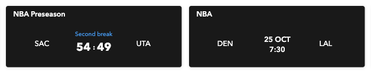
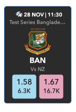

# Scoreboard

## **產品功能**

#### **比分卡**

1.  比分卡 UI 版型種類

    * 板球：

    <figure><figcaption></figcaption></figure>

* 足球：

<figure><figcaption></figcaption></figure>

* 其他球種：

<figure><figcaption></figcaption></figure>

* Cricket Exchange：

<figure><figcaption></figcaption></figure>

## data-props 參數說明

### 依 data-props 的 type 值，data-props 參數作用略有不同：

#### **Type 值為 scoreboard、soccer、others 時：**

| Key                          | Type   | Attributes | Value      | Description                                                                                                                                      |
| ---------------------------- | ------ | ---------- | ---------- | ------------------------------------------------------------------------------------------------------------------------------------------------ |
| type                         | string | required   | scoreboard | widget 資訊圖卡的種類 預設為板球比分卡。 板球比分卡：“scoreboard” 足球比分卡： “soccer” 其他球種比分卡：“others”                                                                     |
| event\_type\_id              | string | required   | 4          | 球種 id，預設為 4: 4 為 Cricket， 1 為 Soccer， 2 為 Tennis， sr:sport:2 為 Basketball， sr:sport:3 為 Baseball， sr:sport:6 為 Handball， sr:sport:4 為 Ice Hockey |
| count                        | string | required   | 6          | 設定要顯示的比分卡張數，預設為6                                                                                                                                 |
| gap                          | string | optional   | 10px       | 設定比分卡的間距，預設為10px                                                                                                                                 |
| width                        | string | optional   | 238px      | 1. 功能為調整寬度。 2. 寬度範圍為 238px \~ 800px,設定的參數值如小於 238px 或大於 800px,將分別以 238px 或 800px 計算。 3.如不調整寬度參數,則可直接不添加該 key值,寬度會以 238px 計算。                     |
| secondary\_background\_color | string | optional   | #1A1A1A    | 1. 功能為調整圖卡背景色。 2. 可輸入顏色名稱、三原色光(RGB)模式、十六進位(HEX)色碼。 3. 如不調整顏色,則可直接不添加該key 值,顏色會以 #1A1A1A 計算。                                                      |
| text\_primary\_color         | string | optional   | #FFFFFF    | 1. 功能為調整文字顏色。 2. 文字包含聯賽名稱、隊名、比分、賠率、over、比賽時間。 3. 可輸入顏色名稱、三原色光(RGB)模式、十六進位(HEX)色碼。 4. 如不調整顏色,則可直接不添加該 key 值,顏色會以 #FFFFFF 計算。                      |
| text\_secondary\_color       | string | optional   | #333333    | 1. 功能為調整賠率框線顏色。 2. 可輸入顏色名稱、三原色光(RGB)模式、十六進位(HEX)色碼。 3. 如不調整顏色,則可直接不添加該 key 值,顏色會以 #333333計算。                                                     |
| secondary\_color             | string | optional   | #AAA8A8    | 1. 功能為調整賠率標題顏色。 2. 可輸入顏色名稱、三原色光(RGB)模式、十六進位(HEX)色碼。 3. 如不調整顏色,則可直接不添加該 key 值,顏色會以 #AAA8A8計算。                                                     |
| quick\_link\_border\_color   | string | optional   | #989898    | 1. 功能為調整 icon 顏色。 2. icon 包含 batting、時間、場地圖例。 3. 可輸入顏色名稱、三原色光(RGB)模式、十六進位(HEX)色碼。 4. 如不調整顏色,則可直接不添加該 key 值,顏色會以 #989898 計算。                      |
| lang                         | string | optional   | en         | 更改語言別,目前可選擇 'en' / 'zh' / 'th' / 'vi' / 'hi’ 等。                                                                                                  |
| team\_logo\_size             | string | optional   | 29px       | 更改隊伍隊徽大小，預設值為 29px。                                                                                                                              |
| text\_ratio                  | string | optional   | 1          | 改變整體比分卡字體大小的倍率，預設值為 1 倍，可接受小數位 ( 例：1.25 )。                                                                                                       |
| box\_shadow                  | string | optional   |            | 調整比分卡的陰影                                                                                                                                         |
| backdrop\_filter             | string | optional   |            | 調整比分卡背景區域的視覺效果(例如：模糊、顏色偏移等)，比方卡背景顏色須為透明或部分透明才有作用                                                                                                 |
| outside\_border\_radius      | string | optional   | 3px        | 調整比分卡外框圓角                                                                                                                                        |
| inside\_border\_radius       | string | optional   | 3px        | 調整賠率外框圓角                                                                                                                                         |
| status\_color                | string | optional   | #4C9EEA    | 調整賽事狀態文字的顏色                                                                                                                                      |

#### **Type 值為 cricketExchange 時：**

| Key                          | Type   | Attributes | Value           | Description                                                                                                   |
| ---------------------------- | ------ | ---------- | --------------- | ------------------------------------------------------------------------------------------------------------- |
| type                         | string | required   | cricketExchange | 顯示板球Exchange                                                                                                  |
| event\_type\_id              | string | required   | 4               | 球種id，目前只接受板球(4)                                                                                               |
| count                        | string | required   | 6               | 設定要顯示的比分卡張數，預設為6                                                                                              |
| width                        | string | optional   | 90px            | 設定比分卡的寬度，預設為90px                                                                                              |
| gap                          | string | optional   | 6px             | 設定比分卡的間距，預設為6px                                                                                               |
| secondary\_background\_color | string | optional   | #2B2B2B         | 1. 功能為調整圖卡背景色。 2. 可輸入顏色名稱、三原色光(RGB)模式、十六進位(HEX)色碼。 3. 如不調整顏色,則可直接不添加該key 值,顏色會以 #2B2B2B 計算。                   |
| text\_primary\_color         | string | optional   | #FFFFFF         | 1. 功能為調整文字顏色。 2. 文字包含主隊隊名、比賽時間。 3. 可輸入顏色名稱、三原色光(RGB)模式、十六進位(HEX)色碼。 4. 如不調整顏色,則可直接不添加該 key 值,顏色會以 #FFFFFF 計算。 |
| text\_secondary\_color       | string | optional   | #999999         | 1. 功能為調整文字顏色。 2. 文字包含聯賽名稱、客隊隊名。 3. 可輸入顏色名稱、三原色光(RGB)模式、十六進位(HEX)色碼。 4. 如不調整顏色,則可直接不添加該 key 值,顏色會以 #999999計算。  |
| border\_color                | string | optional   | #4C9EEA         | 1. 功能為調整邊框顏色。 2. 可輸入顏色名稱、三原色光(RGB)模式、十六進位(HEX)色碼。 3. 如不調整顏色,則可直接不添加該 key 值,顏色會以 #999999計算。                    |
| lang                         | string | optional   | en              | 更改語言別,目前可選擇 'en' / 'zh' / 'th' / 'vi' / 'hi’ 等。                                                               |
| team\_logo\_size             | string | optional   | 36px            | 更改隊伍隊徽大小，預設值為 36px。                                                                                           |
| text\_ratio                  | string | optional   | 1               | 改變整體比分卡字體大小的倍率，預設值為 1 倍，可接受小數位 ( 例：1.25 )。                                                                    |
| box\_shadow                  | string | optional   |                 | 調整比分卡的陰影                                                                                                      |
| backdrop\_filter             | string | optional   |                 | 調整比分卡背景區域的視覺效果(例如：模糊、顏色偏移等)，比方卡背景顏色須為透明或部分透明才有作用                                                              |
| outside\_border\_radius      | string | optional   | 4px             | 調整比分卡外框圓角                                                                                                     |

#### 使用方法

*   請將下方兩個文檔創建置於同一目錄下

    demo.html

    ```html
    <!DOCTYPE html>
    <html lang="en">
    	<head>
    		<meta charset="UTF-8">
    		<meta name="viewport" content="width=device-width, initial-scale=1.0">
    		<title>Document</title>
    		<style>
    			#scorecard {
    				display: flex;
    			}
    		</style>
    	</head>
    	<body>
    		<!-- 渲染比分卡组件的容器 -->
    		<div id="scorecard"></div>
    		<script src="scorecard-widget.js"></script>
    	</body>
    </html>
    ```

    scorecard-widget.js

    ```jsx
    // 存儲已加載的腳本 URL
    const loadedScripts = [];
    const widgetContainers = [];

    // 比分卡 data-props 參數
    const widgetDataProps = {
      type: 'scoreboard', 
    	// 變更比分卡類型 scoreboard:板球 soccer:足球 others:其他球種
    	// cricketExchange:板球Exchange
      event_type_id: '4', // 球種資料id，板球: 4、足球: 1、網球: 2
      count: '6', // 要顯示的比分卡張數
      width: '',
    	gap: '',
      secondary_background_color: '',
      text_primary_color: '',
      text_secondary_color: '',
      secondary_color: '',
      border_color: '',
      quick_link_border_color: '',
      lang: '',
      team_logo_size: '',
      text_ratio: '',
    	box_shadow: ''
    };

    // 獲取 widget 腳本
    async function loadWidgetScript() {
      if (!loadedScripts.includes('widget')) {
        const script = document.createElement('script');
        script.src = 'https://storage.googleapis.com/oddsbeta-web-stage/widgetsV2/main.js';
        script.async = true;
        document.body.appendChild(script);
        loadedScripts.push('widget');
        return new Promise((resolve) => {
          script.onload = resolve;
        });
      }
      return Promise.resolve();
    }

    async function createWidgets() {
      // 創建比分卡
      const widgetContainer = document.createElement('div');
      widgetContainer.className = 'himalaya-dashboard';
      widgetContainer.setAttribute(
        'data-props',
        JSON.stringify({
          ...widgetDataProps,
        }),
      );
      document.getElementById('scorecard').appendChild(widgetContainer);
      widgetContainers.push(widgetContainer);
      // 引入比分卡 widget
      await loadWidgetScript();
    }

    // 在用戶嘗試離開頁面之前執行清理工作
    window.addEventListener('beforeunload', () => {
      // 移除小部件容器
      widgetContainers.forEach((container) => container.remove());

      // 移除小部件腳本元素
      loadedScripts.forEach((scriptName) => {
        const scriptElement = document.querySelector(`script[src*="${scriptName}"]`);
        if (scriptElement) {
          document.body.removeChild(scriptElement);
        }
      });
    });

    // 執行創建小部件的函數
    createWidgets();
    ```
