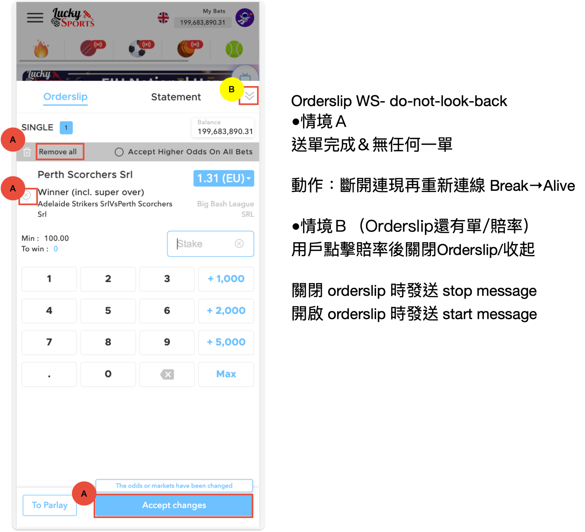

# interact ws

[resource](https://docs.google.com/document/d/1t1WK5dY-Ugv-kHbhVmrUVJT8RlqAAiYROyLPBYlfD70/edit#heading=h.b4gu5pq60a1s)

#### Update Record <a href="#b4gu5pq60a1s" id="b4gu5pq60a1s"></a>

2023/11/06 新增 fancy 盤口報價

#### Intro <a href="#id-3q1kd4vkm7af" id="id-3q1kd4vkm7af"></a>

本文件對於2023/05 開始開發的 interact websocket 進行敘述。 interact websocket 與過往websocket 差異點在於其具有互動性。 前端可以輸入指令改變 websocket 吐出值的邏輯。

#### url： <a href="#h5b770a3wz0c" id="h5b770a3wz0c"></a>

目前開放的第一版 互動行 websocket 的 url 為 /quote/do-not-look-back，目前只會吐報價訊息的序列。

**url 範例：**wss://webapi.ckex.xyz/dev-f/quote/do-not-look-back?authorization=bearer%20eyJhbGciOiJIUzI1NiIsInR5cCI6IkpXVCJ9.eyJ1c2VyX2lkIjoiNGRhMWU5ZDgtMWUxZS00NGMzLTkxNmMtNTgxOGQyYmU0YmRhIiwicGxheWVyX2lkIjoiY2tleF90ZXN0X3BsYXllcjEiLCJtZXJjaGFudF9jb2RlIjoiYmFja29mZmljZS1kOWUzMiIsImlzc3VlZF9hdCI6IjIwMjMtMDItMTBUMDg6NTc6MjkuOTExNzA3NDE1WiIsImV4cGlyZXNfYXQiOiIyMDMwLTAyLTEwVDAwOjAwOjAwLjAwMDAwMDYzNFoiLCJsYW5ndWFnZSI6ImVuIn0.1HzNrrIGrETdgTpANw6IAh2ZNvpr4sG0-n7jnPIIlnw

#### 客戶對服務下指令的格式: <a href="#hic77vzaxl3x" id="hic77vzaxl3x"></a>
```javascript
{
    "type": "object",
    "properties": {
        "commend": {
            "type": string,
          “description”: 值請參考**用法**段落, 目前有order-slip, start, stop 功能
        }
    },
    "required": [
        "commend"
    ]
}
```
#### 用法： <a href="#l4zz5in2uce1" id="l4zz5in2uce1"></a>

連線，連線完成後，客戶端從 websocket 傳送訊息給服務端。訊息格式如下：

1. 登記 order slip (sport book) 報價：
   1. 客戶端發送訊息value為 “order-slip-quote@chloe-market#{eventID}@{marketID}”

ex:
```json
{"commend":"order-slip-quote@chloe-market#40789105-e@219_33753655"}
```

*
  1. 意涵: 代表要求傳送一場比賽一個盤口的即時報價, 在傳送成功後, 該盤口的便會持續傳來即時報價, 持續至少一小時。

ps. 每次點擊加入 orderslip 送出一次，後端送出資料新增該筆相關資料

1. 登記 order slip (fancy) 報價：
   1. 客戶端發送訊息value為
```javascript
"order-slip-quote@fancy-market#{eventID}@{marketID}"
```
ex:
```json
{"commend":"order-slip-quote@fancy-market#44914246-e@878_55854706_f"}
```

1. 暫停與開始
   1. 客戶端發送訊息 value 為 “start” 代表開始
   2. 客戶端發送訊息 value 為 “stop” 代表暫停

ex: ‘{"commend":“stop”}’, ‘{"commend":“start”}’

1. unscribe 盤口, 不讓指定盤口繼續吐報價: // 已測
   1. 客戶端發送訊息value為

“unsubscribe-order-slip-quote#{eventID}@{marketID}”

ex:

```json
{"commend":"unsubscribe-order-slip-quote#40789105-e@219_33753655"}
```
#### 傳送的資料格式範例： <a href="#d5jh728wxr93" id="d5jh728wxr93"></a>

**sport book**

```json
{
    "type": "order-slip",
    "data": [
        {
            "event_id": "41115853-e",
            "market_id": "1_31260330",
            "product_id": "1",
            "price": "1.61",
            "status": "1"
        },
        {
            "event_id": "41115853-e",
            "market_id": "1_31260330",
            "product_id": "2",
            "price": "2.37",
            "status": "1"
        },
        {
            "event_id": "41115853-e",
            "market_id": "1_31260330",
            "product_id": "3",
            "price": "10.26",
            "status": "1"
        }
    ]
}
```

**fancy**
```json
{
    "type": "order-slip-fancy",
    "data":[
        {
            "mid":"878_55854706_f",
            "pid": "1",
            "bl": "181",
            "bo": "0",
            "ll": "181",
            "lo": "0",
            "status": "-3",
            "ut": "2023-11-07T08:29:39.306Z"
        }
    ]
}
```
#### data schema: <a href="#o6w84ed2a22d" id="o6w84ed2a22d"></a>

**回傳資料schema**

| field | type    | describe                                                                                                           | required |
| ----- | ------- | ------------------------------------------------------------------------------------------------------------------ | -------- |
| type  | string  | <p>傳送的資料的種類, 目前有以下幾種:</p><p>"order-slip",</p><p>"order-slip-fancy"</p><p>"alive",</p><p>"error"</p> | true     |
| data  | \[]item | 根據形態的不同, item會有不同的schema. 詳細參考下面                                                                 | false    |
| error | string  |                                                                                                                    | false    |

**sport book**

當 data.type 為 order-slip 時, 資料形式為 sport book odds, schema 如下

| field       | type   | describe                                              |
| ----------- | ------ | ----------------------------------------------------- |
| event\_id   | string |                                                       |
| market\_id  | string |                                                       |
| product\_id | string |                                                       |
| price       | string | 賠率                                                  |
| status      | string | <p>盤口狀態:</p><p>1: 打開並顯示</p><p>其他: 鎖頭</p> |

**fancy**

當 data.type 為 order-slipt-fancy 時, 資料形式為 fancyOdds, schema 如下:

| field  | type   | describe                                              |
| ------ | ------ | ----------------------------------------------------- |
| eid    | string | eventID                                               |
| mid    | string | marketID                                              |
| pid    | string | productID                                             |
| bl     | string | back 的 line                                          |
| bo     | string | back 的 賠率                                          |
| ll     | string | lay 的 line                                           |
| lo     | string | lay 的賠率                                            |
| status | string | <p>盤口狀態:</p><p>1: 打開並顯示</p><p>其他: 鎖頭</p> |

4\. 開啟 orderslip 時發送 start message\

