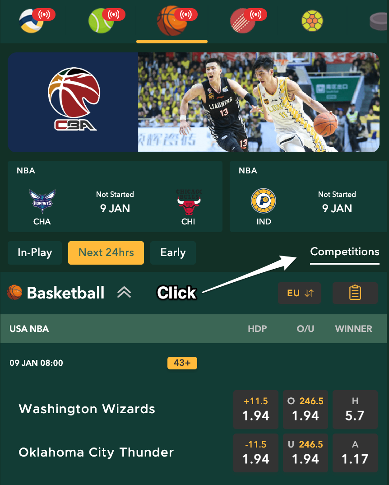
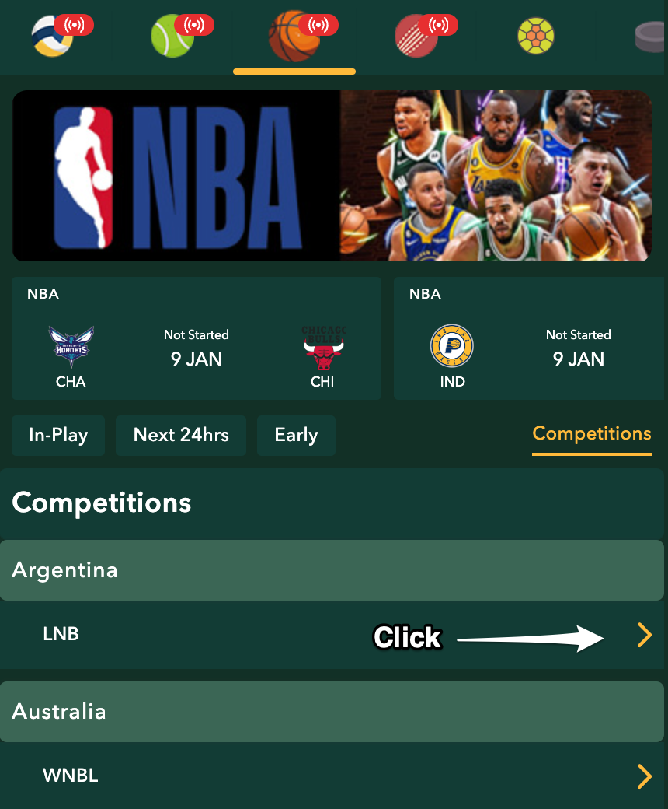
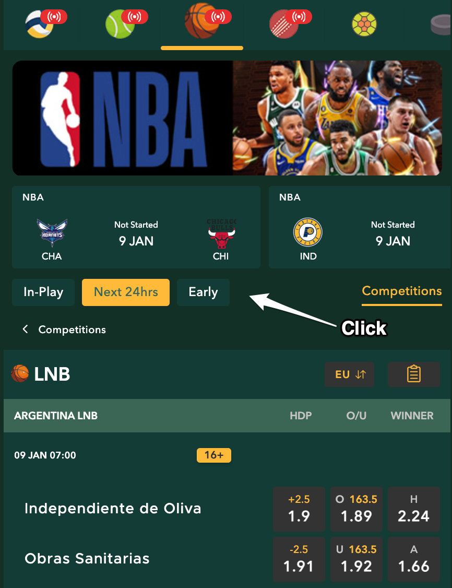

# 球種頁面

### **操作流程**

　　挑選球種

<figure><figcaption></figcaption></figure>

　　點選任一時段（In-play/Next 24hrs(預設顯示)/Early）顯示該球種比賽

<figure><figcaption></figcaption></figure>

　　或是想要查看該球種之任一聯賽

<figure><figcaption></figcaption></figure>

　　點選聯賽

<figure><figcaption></figcaption></figure>

　　點選任一時段（In-play(預設顯示)/Next 24hrs/Early）顯示該聯賽

<figure><figcaption></figcaption></figure>

　　返回聯賽總覽頁面

<figure><figcaption></figcaption></figure>

### 目前問題

　　待補充

### 路由

　　category/:sport(category.js)&#x20;

　　<mark style="color:blue;">**> (點選filterBtn)**</mark> category/:sport/:filterStatus <mark style="color:red;">(category.js)</mark>&#x20;

　　<mark style="color:blue;">**> (點選competitions)**</mark>  category/:sport/competitions <mark style="color:red;">(competitions.js)</mark>&#x20;

　　<mark style="color:blue;">**> (點選任一聯賽)**</mark>  category/:sport/:tournament/:filterStatus <mark style="color:red;">(tournamentPage.js)</mark>　　
