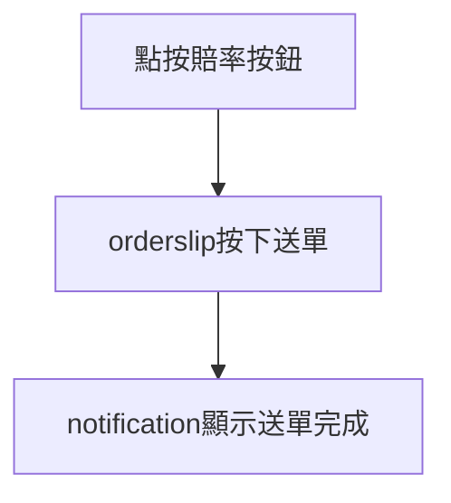

# exchange

## Test 原因

由於 fancy 最優先製作導致所有 exchange 盤口 pid === '1' 時會被判定為 fancy 單

依照 2023.09.05

```jsdoc
 /**
  * @description 固定 placeOrderMode === 'EXCHANGE' (全單種分為 SINGLE/PARLAY/EXCHANGE)
  * @description 實作階段 圖面 title 名稱          | 名稱     : 判斷條件
  * @description 階段 1. title: fancy/Exchange   | fancy   : product_id === '1'
  * @description 階段 2. title: Match Odds       | exchange: source === "betfair" && product_id !== '1' 
  * @description 階段 3. title: Bookmaker Market | exchange: source === "Bookmaker" 
  * @description source 只有 'Bookmaker' / 'betfair' ，來源為前端指定協助 api：place-order 判別用 
  */
```

2024.01.11 更改

```jsdoc
 /**
  * @description 固定 placeOrderMode === 'EXCHANGE' (全單種分為 SINGLE/PARLAY/EXCHANGE)
  * @description 實作階段 圖面 title 名稱          | 判斷條件
  * @description 階段 1. title: fancy/Exchange   | order_x_code === '004'
  * @description 階段 2. title: Match Odds       | order_x_code === '002' 
  * @description 階段 3. title: Bookmaker Market | order_x_code === '003'
  */
```

更動範圍

1. 點按加入 orderslip ( cricket only )
   1. 首頁 / 球種頁
   2. market 頁
   3. auto\_bet
2. orderslip 顯示
3. statement 顯示

## 相關資料

### spec <a href="#https-docs.google.com-document-d-1jf8mdwqwskiursj12stinpuy7an6uswl4mx_wfj8lgu-edit-heading-h.ys11wsb" id="https-docs.google.com-document-d-1jf8mdwqwskiursj12stinpuy7an6uswl4mx_wfj8lgu-edit-heading-h.ys11wsb"></a>

[SportsBook & Exchange下注完整流程介紹](https://docs.google.com/document/d/1jf8MDWqWSKIURsJ12StInpuy7An6UsWl4mx\_wFj8lgU/edit#heading=h.ys11wsb28xdv)

### 流程



### dataflow

```javascript
// 示意用 component 不能拿來跑！！！
component PriceButton(props) {
    // 同一橫排為同一盤口 odds 出現 '-1' 表示關盤，此時 isOpen = false
    const { isOpen } = props;
    // 單一賠率資料
    const eachOddsButtonData = {
        sport: route_path[2],
        event_id: route_path[3],
        market_id: WsData()?.mid,
        market_name: eachMarket?.name,
        product_id: WsData()?.pid,
        // eachMarket 該盤口資料（cover 圖每一橫排）
        product_name: layback === 'b' ? eachMarket.bl : eachMarket.ll,
        price: price,
        layback: layback,
        // matchDetailList 來源於 api match-detail
        team_a: matchDetailList?.team_a?.name,
        team_b: matchDetailList?.team_b?.name,
        type: 'Exchange',
        season_name: matchDetailList?.season_name,
        eventInfo: eachMarket,
        event_type_id: matchDetailList?.event_type_id,
        source: 'betfair' | 'Bookmaker',
        // 新增
        order_x_code: '004',
    };    
    // 被點按要做的事
    onclick = () => {
        if (status === 'open' && odd > 1 && isOpen === true) {
        // 送單流程開啟條件為加入購物車列表項目 > 1
            orderslipList.push(
                eachOddsButtonData
            )
        }
    }
}
```

